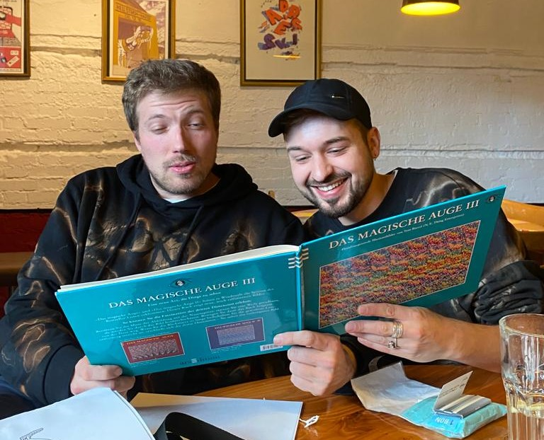

+++
title = "Eine Geschichte aus dem Herzen der Berner Musikszene"
date = "2024-02-27"
draft = false
pinned = false
image = "fhg-reportage.jpg"
description = "\n"
+++


Die zwei Hip-Hop Rapper Pit und Migo, sitzen im Restaurant «Sous Le Pont» und trinken ein Gläschen Sirup. Die Stimmung ist noch ruhig hier. Doch nur einige Tage später, wird man im Dachstock, gleich nebenan, die Bässe wummern hören. Pit und Migo sind zwei, der drei Mitglieder aus der Band FHG. Neben dem Rap Kollektiv «Chaostruppe», ist FHG die bekannteste auf Mundart rappende Gruppe in Bern. Migo und Pit sind die Rapper FHG’s aber gleichzeitig auch ein Teil der «Chaostruppe». Trotz der ganzen Planung für ihr Jubiläumskonzert im Dachstock, nehmen sie sich die Zeit, uns ihre Geschichte zu erzählen und wieso dieser Ort hier für sie so besonders ist.



### In einer Woche ist das 10-jährige Jubiläum von FHG: Wie ist die «Fischermätteli Hood Gang» damals entstanden?

Pit und ich kennen uns schon sehr lange, aber da habe ich zuerst mit einem anderen Kolleg angefangen Musik zu machen, er machte die Beats und ich habe gerappt. Irgendwann hat Pit mich ins «Freestylerümli» mitgenommen, aus dem dann die Chaosgruppe entstanden ist. Neben der Chaostruppe ist mit Iroas, dem dritten Mitglied, FHG als Spassprojekt entstanden. 

Woher kommt der Name FHG?

Das ist einfach die Fischermätteli Hood Gang! Wir sind zufällig darauf gestossen und dachten, wir nennen uns jetzt so, mit der festen Überzeugung, dass auch ein dummer Name irgendwann cool klingt, wenn die Menschen ihn nur oft genug sagen. Ausserdem haben wir im Fischermätteli gewohnt. Der Name ist einfach aus einer lustigen Idee entstanden, wie eigentlich das ganze FHG-Projekt. Auch die Songs entstehen oft so, dass jemand eine dumme Idee hat, die dann aber weitergesponnen wird. Und wenn man erst damit angefangen hat, will man auch nicht mehr aufhören. Am Schluss sind die Lieder aber meistens trotzdem nice.

Was war bis jetzt der schönste Auftritt?

Letztes Jahr im Dachstock war es mega mega schön. Aber meiner Meinung nach, ist es gar nicht ein spezifisches Konzert, sondern mehr, dass wir diesen Weg des Spasses verfolgen. Ich glaube das ist sehr wertvoll und gibt uns viel Kraft. Der Spass ist ein bisschen wie unser Benzin. Es ist uns auch eine Ehre, dass all diese Leute unsere Musik hören wollen und an unsere Konzerte kommen. Es gibt einfach immer sehr viele schöne Interaktionen und Verknüpfungen, die entstehen.

Kann man als Künstler*in der Schweiz von der Musik leben?

Wir verdienen tendenziell immer weniger. Wir arbeiten auch sehr unregelmässig: Man arbeitet an einem Album, an den Songs, aber bis sie draussen sind, vergehen zwei Jahre. Danach spielt man einige Konzerte, bekommt dort ein bisschen Gage und kriegt dann noch ein Jahr später ein Visa. (Das sind Beiträge, die gezahlt werden, wenn deine Musik irgendwo gespielt wird.) Nochmal ein Jahr darauf kriegt man dann das Geld dafür. Es ist gar nicht planbar, wenn ich jetzt etwas schreibe, ich vielleicht in ein paar Jahren etwas daran verdienen werde. Im Moment funktioniert es für mich. Zu sagen, dass man davon leben kann, wäre aber trotzdem gelogen.
 Aufwand und Gewinn stimmen eigentlich nicht überein. Von der Zeit her ist das Musikmachen wie ein Vollzeitjob, aber vom Geld her reicht es knapp, um über die Runden zu kommen, wenn überhaupt.
Wieso feiert ihr den Geburtstag im Dachstock?
«Seit ich 15 bin, war ich einfach immer hier» erzählt Pit, deshalb wollen wir den Geburtstag im Dachstock feiern, weil wir eigentlich alle unsere Jugend hier verbracht haben. Wir waren auch früher im Haus (der Reithalle) sehr politisch aktiv und es macht hier am meisten Sinn.»

Was würdet ihr auf die Vergangenheit blickend anders/besser machen?

Im Nachhinein würden wir manchmal etwas besser überlegen. Vor allem Aktionen, die im Moment vielleicht lustig sind, haben wir manchmal nicht ganz durchdacht. FHG hat als Spass-Projekt angefangen. Mit der Zeit sind es immer wie mehr Leute geworden, die unsere Musik hörten und damit kam auch mehr Verantwortung, wo man sich überlegen muss, was will ich aussagen. «Wenn sich jetzt irgendjemand sehr dumme Zeilen als Vorbild nehmen würde, wäre das sehr schade», erklärt Pit. Es ist schwierig, denn wenn wir manche Fehler nicht gemacht hätten, wären wir jetzt vielleicht nicht an einem geileren Ort, weil wir aus den Fehlern auch lernen konnten.

Was würdet ihr einer anstrebender Musiker*in mit auf den Weg geben? 

Habt Spass und lasst euch nicht verunsichern! Zuerst ist es immer komisch, die eigene Stimme zu hören und man findet nicht direkt coole Beats, aber man muss daran denken; es ist wie jedes andere Hobby, es braucht Training und Leidenschaft, um irgendwo hinzukommen. Es ist wichtig, dass man Sorge zu sich trägt und sich nicht verbiegen lässt. Denn man zahlt einen hohen Preis, wenn man etwas macht, dass man eigentlich gar nicht will. «Ich würde möglichst kompromisslos sein und wirklich auf Trends schei\*\*en», so Migo. Ich finde, man sollte immer im Auge behalten, dass es cool wäre, wenn die Menschen den Song auch noch in fünf Jahren hören möchten.