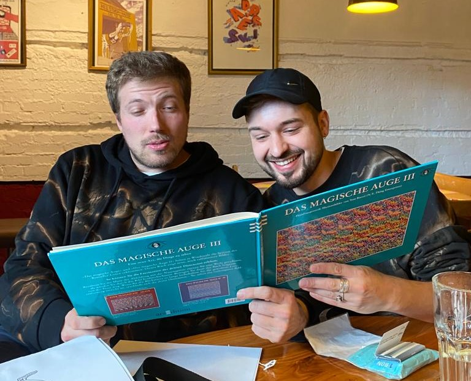

+++
title = "Geld oder Gefühl: Der Spagat zwischen Kunst und Kommerz in der Musikwelt"
date = "2024-02-20"
draft = false
pinned = false
image = "fhg-reportage.jpg"
description = "\n\n\n"
footnotes = ""
+++
Die Schule hinschmeißen und berühmte*r Künstler*\**in werden ist vielleicht der Traum vieler Jugendlichen. Aber ist das wirklich so einfach? Die Musikgruppe FHG, gewährt uns einen kurzen Einblick hinter ihre Kulissen.  

Louisa Steiner, Seraina Espinoza Rios

Es gibt kein Entrinnen, wenn man inmitten dieser Menschenmasse steht. Die Atemfrequenz steigt an. Die Aktivität der Muskeln und der Schweissdrüsen nimmt zu. Der Herzschlag beschleunigt sich. Im Kopf tobt ein Sturm, der die Kontrolle über sich selbst verlieren lässt. Der Bass lässt deinen Körper beben und man beginnt zu zittern. Man fühlt sich plötzlich Fremden so nahe, weil man spürt, dass alle dasselbe fühlen. 
FHG schafft es, dass rund 700 Menschen dieses unvergessliche Gefühl erleben dürfen.

### 
Ein Raum mit drip

Endlich ist es so weit. Wie jedes Jahr findet der “FHG-Geburtstag” statt. Sie spielen im Dachstock ihr 10-jähriges Jubiläum. „Ich habe die meiste Zeit meiner Freizeit im Dachstock verbracht”, so der Rapper, Pit. Der Dachstock ist mehr als nur ein Dachboden. Er ist ein Ort, an dem Menschen, die dieselben Interessen teilen und die gleichen Künstler*innen bewundern, zusammenfinden. Der Dachstock bietet in Bern kreative und alternative Musik, Kunst und Kultur. Auch für Migo und Pit war der Dachstock oder besser gesagt die ganze Reitschule ein wichtiger und prägender Ort ihrer Jugend. Der Dachstock ist ein Veranstaltungsort an der Neubrückstrasse 9 in Bern und hat sich aus einer ehemaligen Hausbesetzung heraus entwickelt. Er ist als Teil der Reitschule, seit 1987 in Betrieb und fasst rund 700 Personen. Durch sein charmantes Gebälk hat er eine einzigartige, "noch weit über die Stadtgrenze hinaus bekannte” Akustik, meint Migo. Fast hundert Menschen arbeiten zusammen, um ein hochwertiges kulturelles Programm, von Konzerten, Bücherlesungen, über Podiumsdiskussionen bis zu Flohmärkten, auf die Beine zu stellen. Dabei arbeitet das Team basisdemokratisch, was so viel bedeutet wie, dass sie keine “Führungspositionen” haben. Jede Meinung soll gleich viel zählen und Entscheidungen werden zusammen gefällt. Pit meint: “Es gibt keinen besseren Ausgangsort als den Dachstock”. Denn anders als bei den meisten Ausgangslokalen, darf man in den Dachstock seine eigenen Getränke mitnehmen und es besteht kein Rauchverbot, respektive hält sich einfach niemand daran und du wirst nicht darauf hingewiesen. Auch die Akustik ist eindrücklich, da der Großteil des Dachstocks aus Holz besteht und auch schon älter ist. Das alles zusammen macht den Dachstock einzigartig in einem großen Umkreis.

### 
*Wenn Traum und Realität nicht übereinstimmen…*

Das Musikerinnen Leben stellt man sich eigentlich ganz toll vor. Die Künstlerinnen schreiben ein paar Songs, verdienen damit viel Geld und leben ein glamouröses Leben. Migo, der das Gymnasium hinschmiss und Künstler wurde, lebt in der Fantasie seiner Fans vielleicht das ultimative Traumleben. In Wirklichkeit läuft das Ganze allerdings etwas anders ab. Pit und Migo erzählen, dass gerade in der Schweiz ein Leben als Mundartmusiker*in sehr unrealistisch sei, da die Produktion von Songs sehr teuer und der Gewinn daraus nur niedrig ist. „Für uns ist die Freude am Musik machen das Wichtigste. Wenn es uns keinen Spass mehr macht, dann hören wir auf, weil der Aufwand und der finanzielle Gewinn nicht übereinstimmen“, erklären Pit und Migo. Außerdem sind die beiden davon überzeugt, dass die Qualität der Songs um einiges tiefer wäre, hätten sie keine Freude an ihrer Arbeit. Da sie wegen ihrer Musik bekannt sind, haben sie natürlich auch eine gewisse Verantwortung, was sie in ihrer Musik thematisieren. Auf die Frage, was sie heute anders machen würden, erwiderten sie, sie würden gewisse Zeilen aus älteren Songs nicht mehr so schreiben. Ihnen ist wichtig, dass ihre Meinungen heute zum Teil anders sind als früher und sie nicht mehr alle Songtexte zu hundert Prozent vertreten.

### 
„Auch ein dummer Name kann irgendwann cool klingen, wenn die Menschen ihn nur oft genug sagen.“

#### (Zitat: Migo)

FHG ist ca. 12 Jahre alt und entstand aus einer Idee von vier Musiker, aus dem grösseren Berner Rap Kollektiv “Chaostruppe”. Die anfangs vier Mitglieder Lance Trance, Poul Soul, Frank Punk und Noa Goa waren voller Energie und kreativen Ideen. Um diese Ideen umzusetzen, gründeten sie FHG. Der Name FHG entstand, weil die “Gang” oft im Fischermätteli in Bern zusammen abgehangen hat. Sie legten ihren Namen fest mit der festen Überzeugung, dass man ein Name, der unbekannt und uncool klingt, so oft sagen kann, bis er irgendwann auch cool klingt. Auf die Art und Weise, wie sie den Bandnamen gewählt haben, entstanden und entstehen immer noch viele ihrer Songs. Oft hat jemand eine kuriose Idee, die sie dann meist weiterspinnen und am Schluss entsteht daraus ein hochwertiger cooler Song. Es ist FHG jedoch auch wichtig, dass die Lyrics (die Liedtexte) eine Bedeutung haben. Sie investieren deswegen für den Feinschliff viel Zeit.
Neben Songs, die aus lustigen Ideen entstanden sind, haben sie auch viele politische Raps, wie der erste erfolgreiche Song von ihnen, „Tätowiert & Vorbestraft“.Er wurde berühmt wegen seines Musikvideos. Er erschien 2015 in FHGs zweitem Mixtape, das „No 2 Minutä bis dr Bus chunnt“ heisst.

### Erfolg bringt nicht nur Glimmer mit sich

„Hip-Hopper brüsten sich mit Vandalismus“ Diese Schlagzeile erschien 2015 im Magazin ‚20 Minuten‘. Oder: „Eine Berner Rap-Gruppe missbraucht die Fahrzeuge des öffentlichen Verkehrs als Leinwand und prahlt damit in einem Video“, berichtet der Bund. Das provokative Video zum Song „Tätowiert & Vorbestraft", weckte sogar die Aufmerksamkeit der Kantonspolizei Bern. 
Als wir Pit und Migo beim Interview fragen, wie die Reaktionen bei ihnen im Umfeld aussahen, erzählt Pit, dass eigentlich alle persönlichen Reaktionen positiv waren, da sie eher in einer Szene unterwegs seien, in der man solche Aktionen toll findet. Allerdings hat das dritte Bandmitglied Iroas kurz nach der Veröffentlichung des Musikvideos, einen alten Klassenkameraden wieder getroffen, der mittlerweile bei der BLS tätig ist. Der fand die Sprayaktion gar nicht lustig und meinte zu Iroas, er solle mal selbst einen Zug putzen, um zu sehen, wie aufwendig das sei. Aber das wurde eher mit viel Humor genommen und heute ist es ein sogenannter ‘Running Gag’ in der Gruppe, dass jemand zu Iroas sagt, er solle mal selbst so einen Zug putzen. 

### Ein besonderer Geburtstag

Am Freitagabend, dem 15.12.2023, war auf dem Vorplatz der Alten Reitschule ordentlich was los. Menschen aus verschiedensten Orten Berns fanden sich zusammen und warteten ungeduldig darauf, dass der Stundenzeiger der Uhr endlich auf 21:00 wechselt und die Türen des Dachstocks geöffnet werden. Langsam stellten sich immer mehr Leute in die Reihe, um ihre Tickets vorzuweisen. Im Dachstock war es etwas frisch, kühl und leer. Doch je mehr Leute kamen, desto voller und heisser wurde es. Der DJ spielte seine Partymusik, und es wurde immer stickiger, während die Menschen sich mit Alkohol versorgten. Die Luft nahm nach und nach den Duft von Tabak und Marihuana an. Um 22:30 Uhr, als die Atmosphäre perfekt war, wurde die Musik leiser und die Menschenmenge lauschte gebannt der Stille. Da tanzte sich der Vor-Act, Etoclit, zu einem ihrer Tracks auf die Bühne. Für eine Stunde durften wir gebannt ihrer Musik lauschen. Alle waren traurig, dass ihre Show schon zu Ende war, doch gleichzeitig auch aufgeregt und erfreut, da man wusste, dass der Auftritt des Haupt-Acts jetzt ganz nahe war. 
Dann war es endlich so weit, FHG kam auf die Bühne. Sie warfen Zeichnungen, Essen und Getränke ins Publikum und beschenkten alle. Dazu rappten sie natürlich ihre Songs. Als das Konzert zu Ende war, deckten sich alle noch einmal mit Getränken ein, wobei der DJ noch bis in die frühen Morgenstunden  seine Kunst beweisen durfte.

### «Die Reithalle ist mein zweites Zuhause, ich bin seit meiner Jugend regelmässig hier!»

#### (Zitat Pit)

Die Gründer von FHG haben alle eine unterschiedliche persönliche Verbindung zur Reithalle. So hat zum Beispiel Pit einen Grossteil seiner Jugend auf dem Vorplatz verbracht. Wie Pit und Migo beim Interview erzählen, gingen sie früher in den Dachstock, um zur Musik ihrer Lieblingskünstler*innen abzutanzen. Als später FHG entstand, war es für sie ein grosser Traum, auch einmal im Dachstock auftreten zu können. Heute gehen viele überwiegend junge Menschen in den Dachstock, um ihre Lieblingsband FHG zu hören.

Heute gehen die jungen Menschen in den Dachstock, um ihre Lieblingsband FHG zu hören. 



### Was passiert im Musikvideo zu Tätowiert & Vorbestraft

Den ersten grosse Erfolg hatte FHG durch einen Song, der auf dem Albumcover einen von ihnen mit Graffiti besprayten BLS Zug mit der Aufschrift des Songtitels ‘Tätowiert & Vorbestraft’ zeigte. Das Musikvideo dazu sorgte in den Medien für viel negative Aufmerksamkeit, denn es zeigt, wie drei anonyme Personen einen BLS-Zug, das Gurtenbähnli und ein Tram besprayen.

